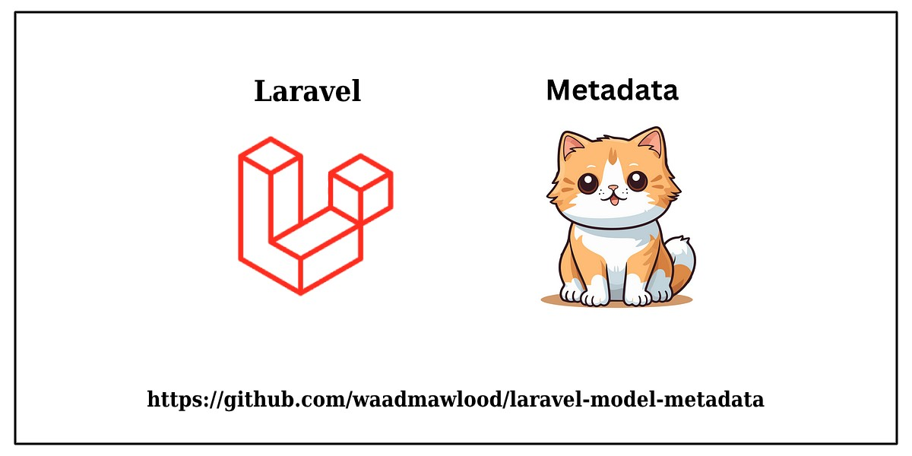

# Laravel Model Metadata

Laravel Model Metadata is a package designed to manage metadata with JSON support for multiple data types. It allows you to easily attach, manage, and query metadata on your Laravel models using the `HasManyMetadata` or `HasOneMetadata` traits.

# 📚 Documentation

For detailed documentation, including usage examples and best practices, please refer to the [Documentation](https://waad-mawlood.gitbook.io/model-metadata).

# ✨ Requirements

- PHP 8.0 or higher
- Laravel framework 9.30.1 or higher
- JSON extension enabled

# 💼 Installation

1. Install the package using Composer:
   ```bash
   composer require waad/laravel-model-metadata
   ```

2. Publish the migration files:
   ```bash
   php artisan vendor:publish --tag=metadata-migrations
   ```

3. Run the migrations:
   ```bash
   php artisan migrate
   ```

# 🎈 Usage

## 🔥 HasManyMetadata Trait

Add the HasManyMetadata trait to your model to enable multiple metadata records:

```php
use Waad\Metadata\Traits\HasManyMetadata;

class Post extends Model
{
    use HasManyMetadata;  // <--- Add this trait to your model
}
```

#### Some methods:

```php
// Create metadata with array or collection
$post->createMetadata(['key1' => 'value1', 'key2' => 'value2']);
$post->createMetadata(collect(['key1' => 'value1', 'key2' => 'value2']));

// Update metadata by ID
$post->updateMetadata('{metadata_id}', ['new_key' => 'new_value']);

// Delete metadata by ID
$post->deleteMetadata('{metadata_id}');

// Get all metadata objects
$metadata = $post->metadata;
// or
$metadata = $post->metadata()->get();

// Get metadata by ID
$metadata = $post->getMetadataById('metadata_id');

// Get all metadata column pluck as array
$allMetadata = $post->getMetadata();

// Get all metadata column pluck as collection
$metadataCollection = $post->getMetadataCollection();

// Search in metadata
$searchResults = $post->searchMetadata('search_term');
```

---------

## 🔥 HasOneMetadata Trait

Add the HasOneMetadata trait to your model to enable a single metadata record:

```php
use Waad\Metadata\Traits\HasOneMetadata;

class Company extends Model
{
    use HasOneMetadata;  // <--- Add this trait to your model
}
```

#### Some methods:

```php
// Create metadata with array (only works if no metadata exists)
$company->createMetadata(['key' => 'value', 'another_key' => 'another_value']);

// Create metadata with collection
$company->createMetadata(collect(['key' => 'value']));

// Update existing metadata
$company->updateMetadata(['new_key' => 'new_value']);

// Delete the metadata
$company->deleteMetadata();

// Get metadata as array
$metadata = $company->getMetadata();

// Get metadata as collection
$metadataCollection = $company->getMetadataCollection();
```

-------------

# 🧪 Testing

To run the tests, use the following command:

```bash
php artisan test
```

# 👨‍💻 Contributors

- **Waad Mawlood**
  - Email: waad_mawlood@outlook.com
  - Role: Developer

# 📝 License

This package is open-sourced software licensed under the [MIT license](LICENSE).
